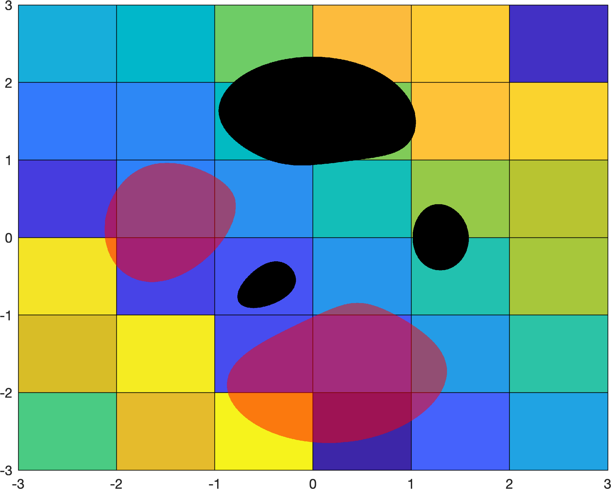

# maskoverlay
A MATLAB function to easily overlay a mask on a plot. Works with opaque or semitransparent masks of any specified color. 

Here's an example where an opaque black mask and a semitransparent red mask have been overlaid on a pseudocolor background: 

``` 
%% Opaque black mask:
maskoverlay(x,y,mask1) 

% Semitransparent red mask wherever Z is less than -2: 
maskoverlay(x,y,mask2,'color',[1 0 0],'alpha',0.5)
```


